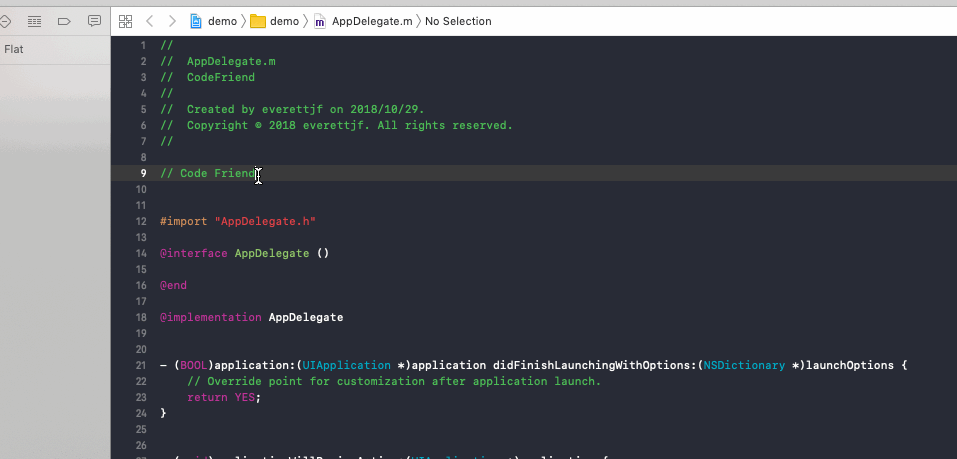
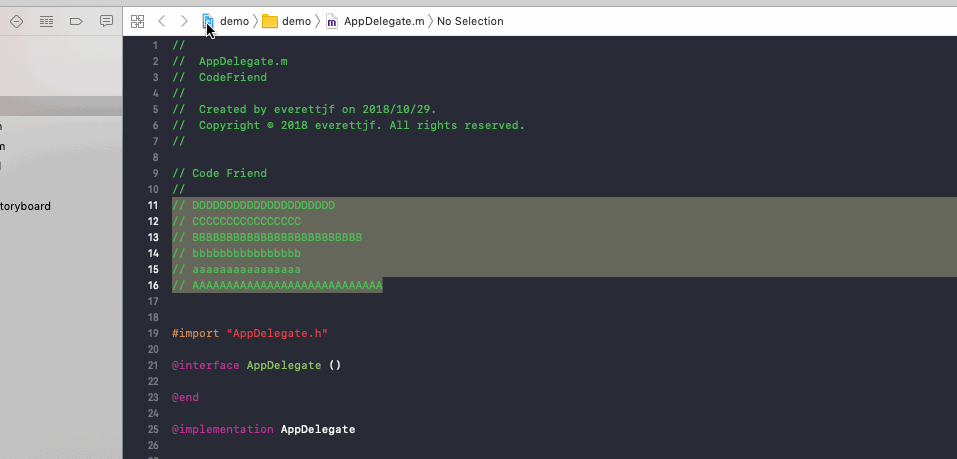
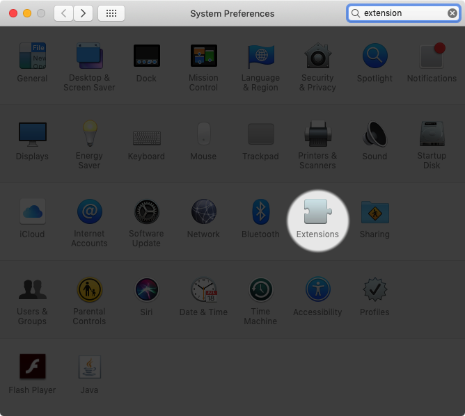
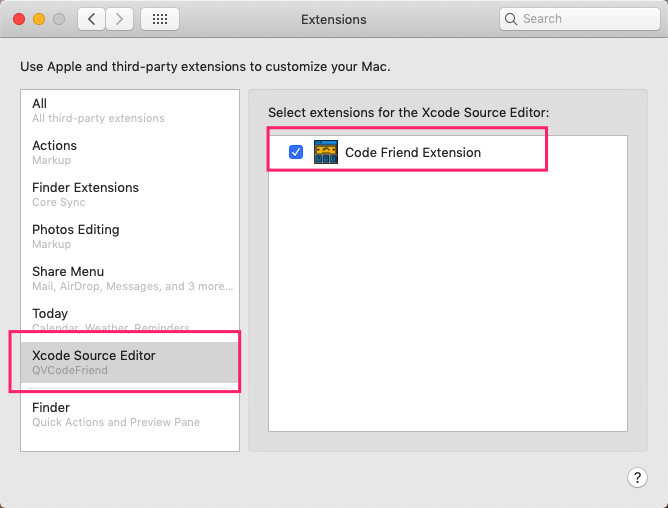

## Code Friend

Code Friend is an Xcode extension that contains many utilities for a variety of usages.

Install from [Mac App Store](https://itunes.apple.com/cn/app/code-friend/id1441249580) and see `How to enable in Xcode` section below.

---

Until now , you can:

1) Convert selected text into ASCII Text.

2) Sort selected lines.

## How to enable in Xcode

System Preferences -> Extensions -> Xcode Source Editor -> Code Friend Extension

## Future

In the near future, `Code Friend` will offer more utitlies for you.

## Feedback

Create Issues [Here](https://github.com/qvcodefriend/qvcodefriend.github.io/issues)

or 

Join WeChat Group

---

*Enjoy!*
